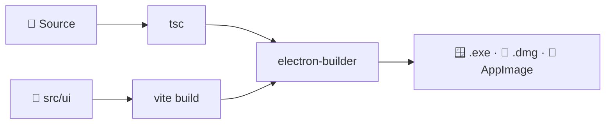

<div align="center">


# ADNzalo

**Desktop app for managing multiple Zalo accounts — CRM · Campaign · Workflow · AI Assistant**
Built for ADN Capital: hidden group-member scan, phone/UID campaigns, Boss↔Employee WAN, per-account proxy

[🌐 Website](https://adncapital.com.vn) · [🇻🇳 Tiếng Việt](./README.md)


</div>

> **Origin:** Fork of `babyvibe/deplao-builder v26.8.5` (MIT), rebranded as **ADNzalo v1.0.0** for ADN Capital. Keeps **Zalo + CRM + Campaign + AI + Workflow**, removes default POS/ERP, adds ADN customizations (gpt-5.6-luna, per-account proxy, free hidden-member scan).

---

## ⬇️ Download

<table>
<tr>
<td align="center" width="50%">

<a href="https://github.com/JJOEEY/ADNzalo/releases/latest/download/ADNzalo-Setup-1.0.0.exe">

</a>

<big><strong>ADNzalo-Setup-1.0.0.exe</strong></big>

</td>
<td align="center" width="50%">

<a href="https://github.com/JJOEEY/ADNzalo/releases/latest/download/ADNzalo-1.0.0-arm64.dmg">

</a>

<big><strong>ADNzalo-1.0.0-arm64.dmg</strong></big>

</td>
</tr>
<tr>
<td align="center" width="50%">

<a href="https://github.com/JJOEEY/ADNzalo/releases/latest/download/ADNzalo-1.0.0.AppImage">

</a>

<big><strong>ADNzalo-1.0.0.AppImage</strong></big><br>
<big>works on any distro - <code>chmod +x</code> & run</big>

</td>
<td align="center" width="50%">

<a href="https://github.com/JJOEEY/ADNzalo/releases/latest/download/ADNzalo-1.0.0.dmg">

</a>

<big><strong>ADNzalo-1.0.0.dmg</strong></big>

</td>
</tr>
</table>

<p align="center">
👉 <strong><a href="https://github.com/JJOEEY/ADNzalo/releases">View all releases</a></strong>
</p>

<details>
<summary>⚠️ First-launch warning (Windows / macOS / Linux)</summary>

ADNzalo is not code-signed, so your OS may show a warning.

**Windows:** More info → Run anyway

**macOS:** Right-click → Open, or System Settings → Privacy & Security → Open Anyway

**Linux:**

```bash
chmod +x ADNzalo-*.AppImage
./ADNzalo-*.AppImage
sudo apt install libfuse2  # if FUSE error
sudo dpkg -i ADNzalo_*_amd64.deb  # or .deb
```

</details>

---

## 🛠️ Tech Stack

- **Core:** zca-js (Zalo)
- **AI Gateway:** OpenAI `gpt-5.6-luna` (default), supports 9Router / OpenRouter
- **Languages:** TypeScript, JavaScript, SQL, HTML, CSS
- **Desktop:** Electron 41, React 18, Vite 6
- **UI:** Tailwind CSS, PostCSS, React Router
- **Local storage:** SQLite via `better-sqlite3` (`adnzalo-tool.db`)
- **State & UI:** Zustand, React Flow, Recharts, Quill
- **Services:** Node.js + Express, Socket.IO

---

## 📦 Install & Build

### Requirements

- Windows 10/11, macOS, or Ubuntu 20.04+
- Node.js 18+, npm 9+

### Install

```bash
cd D:\BOT\ADNzalo
npm install --legacy-peer-deps
```

### Run dev

```bash
npm run dev
# Vite at http://localhost:27799 + Electron
```

### Build production

```bash
npm run production
# outputs dist-electron-build/ADNzalo-Setup-1.0.0.exe (~180MB)
# run without install: dist-electron-build/win-unpacked/ADNzalo.exe
```

### Local data

- SQLite at `%APPDATA%\ADNzalo\adnzalo-tool.db` (migrated from `deplao-tool.db`)
- Media at `%APPDATA%\ADNzalo\media\`
- Change storage folder in `Settings → Storage`
- Auto-update disabled by default (`ADN_DISABLE_AUTOUPDATE=true`)

---

## 🗺️ Architecture

### Build Pipeline



### Runtime

- **Main Process:** IPC handlers (login/zalo/crm/workflow/ai/library/relay/file), Services (DatabaseService, WorkspaceManager, WorkflowEngine, CRMQueueService, AIAssistantService)
- **Renderer:** React pages (Dashboard, Chat, CRM, Campaign, Workflow, Scan, Tracking), Zustand stores
- **Zalo Protocol:** zca-js (QR login, cookie session, WebSocket)
- **External APIs:** OpenAI, Google Sheets, Telegram

### Boss ↔ Employee (REST + Socket.IO)

- Boss runs Relay Server on `:9900` (HTTP REST + Socket.IO)
- Employee connects via LAN (`192.168.x.x:9900`) or WAN Tunnel (ngrok/cloudflared)
- `DataAccessor` auto-routes: boss/standalone → IPC, employee → `RestQueryService` → Boss
- Media cached locally: workspace → Boss → CDN
- Each workspace has isolated DB `adnzalo-tool.db`

### Multi-account & Storage

- Each Zalo account (`zca-js`) → SQLite `adnzalo-tool.db` + `media/` folder + `electron-store` cookies
- `WorkspaceManager` isolates DB per workspace (Local / Remote / Custom)

---

## ✨ Key Features

- **Multi-account Zalo** - unlimited QR/Cookie logins, per-account proxy, quick tab switch, merged inbox
- **CRM & Campaign** - 2-way Zalo labels, internal notes, phone/UID/group campaigns with `3-5 min` delay + `60/h`
- **Hidden member scan** - premium unlocked (always `true`), paste `https://zalo.me/g/...` or scan joined groups auto-detected per account
- **Phone normalization** - strict `0[35789]xxxxxxxx` (10-digit VN), handles `SĐT: 090... - Tên: ...`
- **AI Assistant** - default `OpenAI gpt-5.6-luna`, dynamic prompt per sender `{{senderName}}`, per-account assistant, in-chat suggestions, campaign "AI Write"
- **Script Library** - placeholders `<Honorific> <Zalo Name>` + `Insert Image` + `AI Write`
- **Workflow** - drag-and-drop or Vietnamese AI command ("Create TCX retention workflow"), triggers: message/label/reaction/schedule/groupEvent, actions: send message/image/file/forward...
- **Boss↔Employee WAN** - `HttpRelayService:9900` + `TunnelService`, isolated DB per workspace, real-time Socket.IO
- **Tracking** - `SendHistoryLog` shows `Sent/Seen/Replied/Added/Fail` per campaign
- **Local-first** - all messages/contacts/media stay on your machine

## 🎯 Who is it for?

- ADN Capital sales & customer care at scale via Zalo
- Shops / SMEs with multi-staff inbox (Boss↔Employee)
- Agencies / freelancers managing many client accounts
- Spa, clinic, education, F&B with recurring care

## 🔒 Security

- All data stored locally (SQLite + media), no intermediary server
- QR login, encrypted cookies on device
- Custom storage directory supported
- Local processing, no third-party SDK tracking

## 💻 Requirements

- Stable 24/7 internet for sync & automation
- Keep app running for workflows / team ops
- Close old Deplao when running ADNzalo to avoid DB contention

---

## 📣 Contact

- Website: [https://adncapital.com.vn](https://adncapital.com.vn) · Fanpage: [https://fb.com/adnzalo](https://fb.com/adnzalo)
- Issues: [https://github.com/JJOEEY/ADNzalo/issues](https://github.com/JJOEEY/ADNzalo/issues)
- Affiliate: [https://adncapital.com.vn/affiliate](https://adncapital.com.vn/affiliate)

## 🙏 Acknowledgements

Thanks to original `babyvibe/deplao-builder` and libraries: zca-js, fbchat-v2, and open-source community.

---

## 📝 License

MIT — see [LICENSE](LICENSE).

> Copyright (c) 2026 ADN Capital (original work by babyvibe/deplao-builder under MIT)
