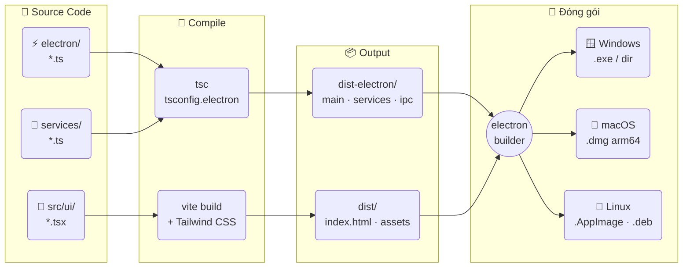
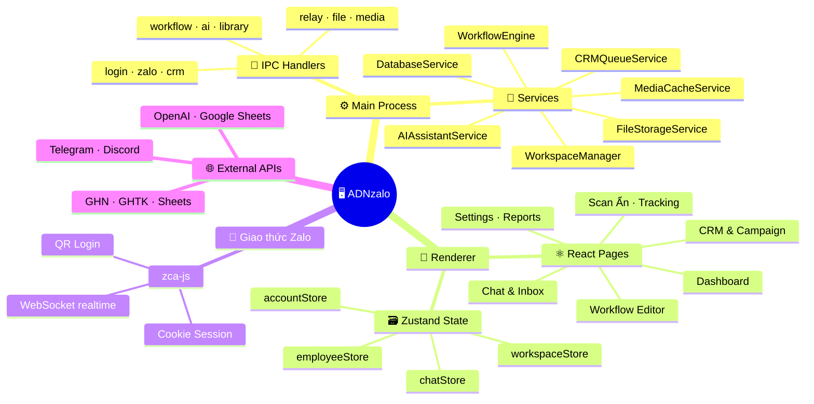
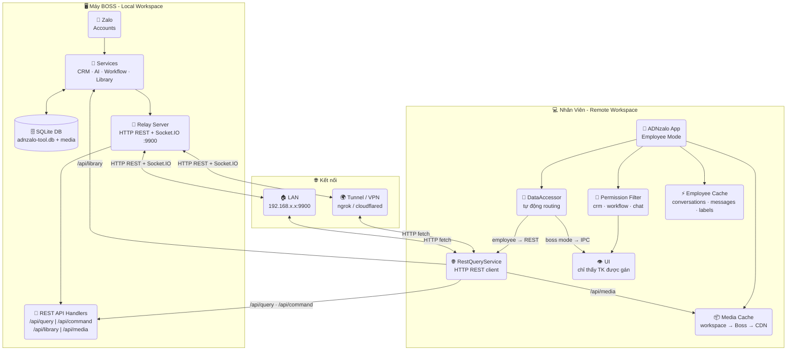
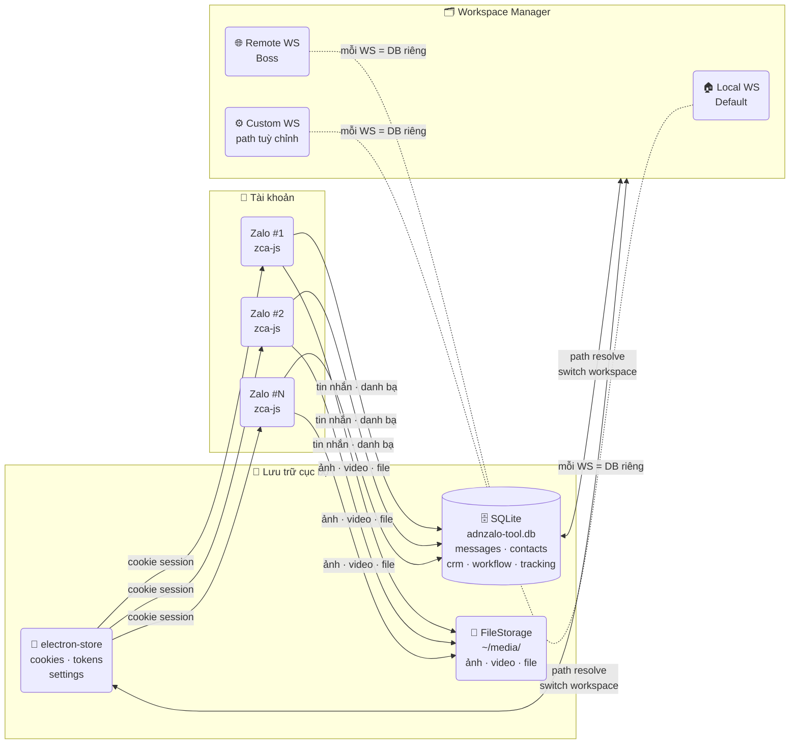
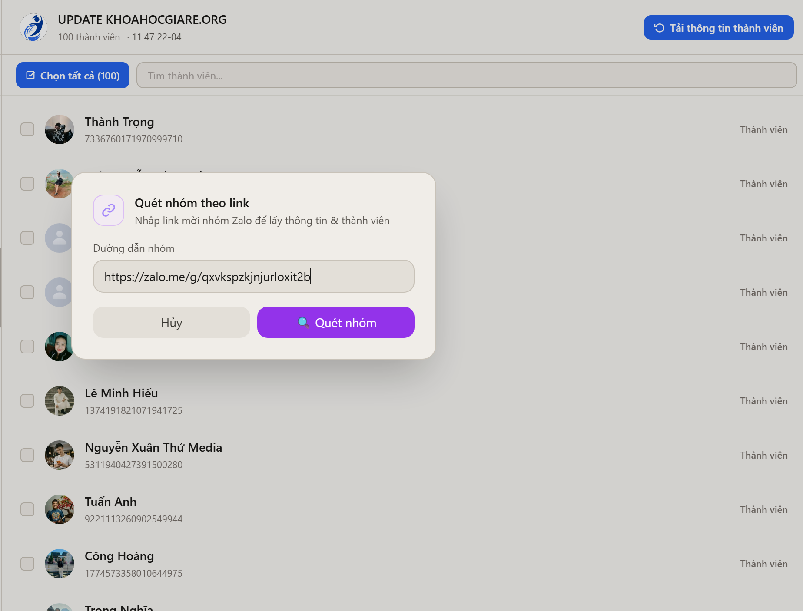
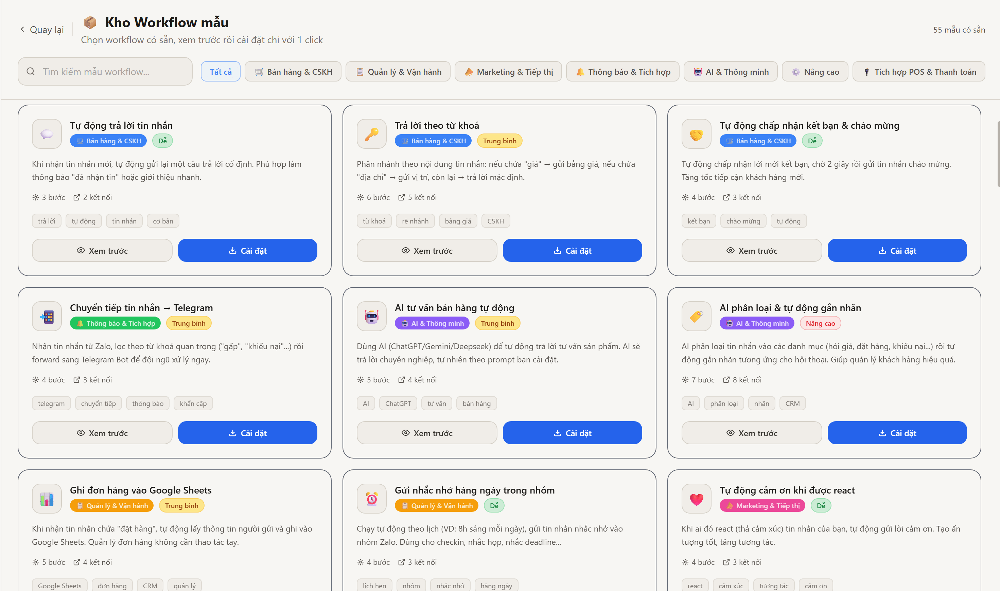
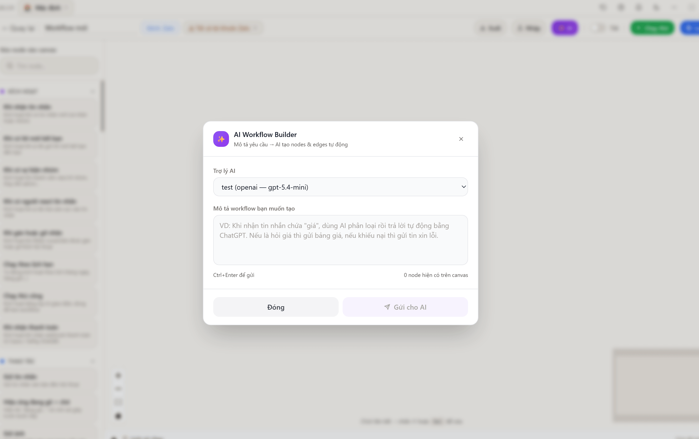
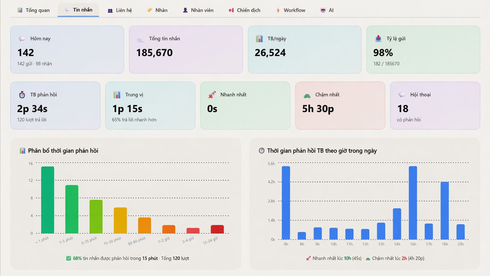

<div align="center">


# ADNzalo

**Phần mềm desktop quản lý tài khoản Zalo đa tài khoản — CRM · Campaign · Workflow · AI Assistant**
Vận hành tập trung cho ADN Capital: quét thành viên ẩn, gửi theo SĐT/UID, Boss↔Nhân viên WAN, proxy riêng từng nick

[🌐 Website](https://adncapital.com.vn) · [🇬🇧 English](./README.en.md) · [📖 Hướng dẫn](./README_ADNZALO.md)


</div>

<p align="center">
  <a href="#-tải-xuống">📥 Tải xuống</a> &nbsp;|&nbsp;
  <a href="#-công-nghệ-ngôn-ngữ-sử-dụng">🛠️ Công nghệ</a> &nbsp;|&nbsp;
  <a href="#cài-đặt">📦 Cài đặt</a> &nbsp;|&nbsp;
  <a href="#-kiến-trúc">🗺️ Kiến trúc</a> &nbsp;|&nbsp;
  <a href="#-tính-năng-chính">✨ Tính năng</a> &nbsp;|&nbsp;
  <a href="#-bảo-mật-dữ-liệu">🔒 Bảo mật</a> &nbsp;|&nbsp;
  <a href="#-giấy-phép">📝 MIT</a> &nbsp;|&nbsp;
  <a href="#-liên-hệ">📞 Liên hệ</a>
</p>

> **Nguồn gốc:** Clone từ `babyvibe/deplao-builder v26.8.5` (MIT), đổi tên thành **ADNzalo v1.0.0** cho ADN Capital. Giữ **Zalo + CRM + Campaign + AI + Workflow**, bỏ POS/ERP mặc định, thêm custom ADN (gpt-5.6-luna, proxy riêng, quét thành viên miễn phí).

---

## ⬇️ Tải xuống

<table>
<tr>
<td align="center" width="50%">

<a href="https://github.com/JJOEEY/ADNzalo/releases/latest/download/ADNzalo-Setup-1.0.0.exe">

</a>

<big><strong>ADNzalo-Setup-1.0.0.exe</strong></big>

</td>
<td align="center" width="50%">

<a href="https://github.com/JJOEEY/ADNzalo/releases/latest/download/ADNzalo-1.0.0-arm64.dmg">

</a>

<big><strong>ADNzalo-1.0.0-arm64.dmg</strong></big>

</td>
</tr>
<tr>
<td align="center" width="50%">

<a href="https://github.com/JJOEEY/ADNzalo/releases/latest/download/ADNzalo-1.0.0.AppImage">

</a>

<big><strong>ADNzalo-1.0.0.AppImage</strong></big><br>
<big>chạy mọi distro - <code>chmod +x</code> là dùng được</big>

</td>
<td align="center" width="50%">

<a href="https://github.com/JJOEEY/ADNzalo/releases/latest/download/ADNzalo-1.0.0.dmg">

</a>

<big><strong>ADNzalo-1.0.0.dmg</strong></big>

</td>
</tr>
</table>

<p align="center">
👉 <strong><a href="https://github.com/JJOEEY/ADNzalo/releases">Xem tất cả phiên bản</a></strong>
</p>

<details>
<summary>⚠️ Lưu ý khi mở file cài đặt (bị chặn bởi Windows / macOS / Linux)</summary>

Do ADNzalo chưa được ký chứng chỉ (code signing), hệ điều hành có thể hiển thị cảnh báo khi mở file.

---

### 🪟 Windows (.exe)

Khi mở file `.exe`, Windows có thể hiển thị cảnh báo **"Windows protected your PC"**:

👉 Cách xử lý:
1. Nhấn **More info**
2. Chọn **Run anyway**

---

### 🍎 macOS (.dmg)

Khi mở file `.dmg`, macOS có thể báo **"cannot be opened because it is from an unidentified developer"**

👉 Cách xử lý:

**Cách 1:**
- Chuột phải vào file → chọn **Open**
- Nhấn **Open** lần nữa

**Cách 2 (nếu vẫn bị chặn):**
1. Vào **System Settings → Privacy & Security**
2. Kéo xuống phần Security
3. Nhấn **Open Anyway**

---

### 🐧 Ubuntu Linux (.AppImage)

Sau khi tải file `.AppImage`:

```bash
chmod +x ADNzalo-*.AppImage
./ADNzalo-*.AppImage
```

> Nếu gặp lỗi "FUSE: fuse2 not available", cài `libfuse2`:
> ```bash
> sudo apt install libfuse2
> ```
Hoặc cài bản `.deb`:
```bash
sudo dpkg -i ADNzalo_*_amd64.deb
```

</details>

---

## 🛠️ Công nghệ & ngôn ngữ sử dụng

ADNzalo hiện được xây dựng trên các công nghệ chính sau:

- **Thư viện chính:** zca-js (Zalo), fbchat-v2 (tuỳ chọn)
- **AI Gateway:** OpenAI (mặc định `gpt-5.6-luna`), hỗ trợ 9Router / OpenRouter
- **Ngôn ngữ:** TypeScript, JavaScript, SQL, HTML, CSS
- **Ứng dụng desktop:** Electron 41, React 18, Vite 6
- **Giao diện:** Tailwind CSS, PostCSS, React Router
- **Lưu trữ dữ liệu cục bộ:** SQLite qua `better-sqlite3` (`adnzalo-tool.db`)
- **State & UI chuyên biệt:** Zustand, React Flow, Recharts, Quill
- **Backend dịch vụ:** Node.js + Express
- **Tích hợp & automation:** Axios, Google APIs / Google Sheets, node-cron, Telegram Bot API, OpenAI API, Socket.IO, v.v.

---

## Cài đặt

<details open>
<summary>🛠️ Tự build từ source</summary>

### Yêu cầu

- Windows 10/11, macOS (Apple Silicon/Intel), hoặc Ubuntu 20.04+
- Node.js 18+ khuyến nghị
- npm 9+

### Cài đặt

```powershell
cd D:\BOT\ADNzalo
npm install --legacy-peer-deps
```

### Chạy development

```powershell
npm run dev
# Vite http://localhost:27799 + Electron
```

### Build app

```powershell
npm run production
# ra dist-electron-build/ADNzalo-Setup-1.0.0.exe (~180MB)
# chạy thẳng không cài: dist-electron-build/win-unpacked/ADNzalo.exe
```

### Dữ liệu cục bộ

- Dữ liệu app dùng SQLite cục bộ: `%APPDATA%\ADNzalo\adnzalo-tool.db` (đã đổi từ `deplao-tool.db`)
- Media: `%APPDATA%\ADNzalo\media\`
- Có thể đổi thư mục lưu trữ trong `Cài đặt → Lưu trữ`
- Lần đầu xóa `C:\Users\<Bạn>\AppData\Roaming\ADNzalo\` cũ rồi mở lại để tạo DB mới nếu migrate từ bản cũ
- Auto-update đã tắt mặc định (`ADN_DISABLE_AUTOUPDATE=true` trong `electron/main.ts`)

</details>

---

## 🗺️ Sơ đồ kiến trúc & luồng hoạt động

### 1️⃣ Luồng Build



---

### 2️⃣ Kiến trúc Runtime



---

### 3️⃣ Mô hình Boss ↔ Nhân viên (REST API + Socket.IO)



> **Kiến trúc ADNzalo:** Employee gọi dữ liệu qua **REST API** (HTTP fetch → Boss) thay vì sync toàn bộ DB. DataAccessor tự động routing: standalone/boss → IPC trực tiếp, employee → RestQueryService → Boss. Socket.IO thay SSE cho realtime ổn định hơn. Media được cache local với cascade workspace → Boss → CDN.

---

### 4️⃣ Đa tài khoản & Lưu trữ



> Mỗi **Workspace** có DB + media folder độc lập - đổi hoặc di chuyển sang ổ đĩa khác không mất dữ liệu.

---

## 🚀 ADNzalo là gì?

Nếu nhìn nhanh, có thể hiểu ADNzalo là:

- **trung tâm vận hành Zalo**: nhiều tài khoản, inbox tập trung, trả lời nhanh
- **lớp quản lý khách hàng**: CRM, nhãn, lịch sử tương tác, campaign theo SĐT/UID/nhóm
- **lớp quét & tìm kiếm**: quét thành viên nhóm ẩn / nhóm chưa tham gia (miễn phí), trích SĐT chuẩn 10 số
- **lớp tự động hóa**: workflow kéo-thả hoặc AI sinh workflow bằng tiếng Việt, chạy nền 24/7
- **lớp AI**: trợ lý `gpt-5.6-luna` gợi ý trả lời, prompt động theo tên nick gửi, campaign "AI viết"
- **lớp quản trị nội bộ**: Boss↔Nhân viên WAN, phân quyền, tracking Đã gửi/Seen/Rep/Kết bạn/Thất bại

## ✨ Điểm nổi bật

- 👤 **Đa tài khoản Zalo** - đăng nhập không giới hạn, QR/Cookie, chuyển tab nhanh, **proxy riêng từng nick**
- 💬 **Hộp thư tập trung** - chế độ gộp tài khoản giúp gom và xử lý hội thoại từ nhiều nick trong một giao diện
- 👥 **CRM & Campaign** - quản lý liên hệ, nhãn 2 chiều, ghi chú. Gửi `phone: 084... → UID` (tự `findUser`), gửi `UID`, gửi `nhóm`, delay `3-5 phút` + `60/h`
- 🔍 **Quét thành viên ẩn** - đã **bỏ chặn Premium** (luôn `true`), banner `Miễn phí cho ADNzalo`. Dán link `https://zalo.me/g/...` hoặc quét nhóm đã tham gia (tự nhận diện nhóm theo từng tài khoản, không cần link)
- 📞 **SĐT chuẩn** - siết `0[35789]xxxxxxxx` (10 số VN), dù dán `SĐT: 090... - Tên: ...` hay `090 123 4567` vẫn trích đúng
- 🤖 **AI Assistant** - mặc định `OpenAI gpt-5.6-luna`, prompt động theo tên nick gửi (`{{senderName}}`), gán mỗi nick 1 trợ lý, gợi ý trong chat, phân loại & trả lời 24/7
- 🖼️ **Kho kịch bản** - placeholder `<Xưng hô> <Tên Zalo người nhận>` + nút `Chèn ảnh` (4 ảnh `assets/demo-adn/`), nút `AI viết`, lưu tái dùng
- ⚙️ **Workflow kéo-thả** + **AI Builder** - gõ tiếng Việt *“Tạo workflow chăm kẹt TCX”* là AI tự sinh node; trigger message/label/reaction/schedule/groupEvent, action gửi tin/ảnh/file/forward...
- 🧑‍💼 **Workspace Boss ↔ Nhân viên WAN** - `HttpRelayService:9900` + `TunnelService` (ngrok/cloudflared), mỗi workspace 1 DB `adnzalo-tool.db` riêng, Socket.IO realtime
- 📊 **Tracking** - `SendHistoryLog` + `TrackingService` xem `Đã gửi/Seen/Rep/Kết bạn/Thất bại` theo từng chiến dịch
- 🔒 **Dữ liệu lưu cục bộ** - ưu tiên quyền kiểm soát và bảo mật trên máy người dùng
- 🔐 **Proxy per-account** - gán Proxy riêng cho từng tài khoản Zalo trước khi đăng nhập

### Xem nhanh

Màn hình sắp theo luồng: dashboard → chat → CRM → quét thành viên → campaign → workflow → tracking.

<table>
  <tr>
    <td>
      
      <br />
      <sub><strong>Dashboard đa tài khoản</strong></sub>
    </td>
    <td>
      
      <br />
      <sub><strong>Chat tập trung + AI gợi ý</strong></sub>
    </td>
    <td>
      
      <br />
      <sub><strong>CRM & liên hệ</strong></sub>
    </td>
  </tr>
  <tr>
    <td>
      
      <br />
      <sub><strong>Quét thành viên nhóm ẩn</strong></sub>
    </td>
    <td>
      
      <br />
      <sub><strong>Chiến dịch gửi tin hàng loạt</strong></sub>
    </td>
    <td>
      
      <br />
      <sub><strong>Workflow editor</strong></sub>
    </td>
  </tr>
  <tr>
    <td>
      
      <br />
      <sub><strong>Chi tiết workflow</strong></sub>
    </td>
    <td>
      
      <br />
      <sub><strong>Ra lệnh tạo Workflow bằng AI</strong></sub>
    </td>
    <td>
      
      <br />
      <sub><strong>Tracking & Báo cáo</strong></sub>
    </td>
  </tr>
</table>

## 🎯 Phù hợp với ai?

ADNzalo phù hợp cho:

- Đội ngũ ADN Capital chốt đơn & chăm sóc khách qua Zalo số lượng lớn
- Shop online / SME cần nhiều nhân viên xử lý inbox cùng lúc (Boss↔Nhân viên)
- Marketing agency hoặc freelancer quản lý nhiều tài khoản khách hàng
- Spa, phòng khám, giáo dục, F&B và các mô hình cần chăm sóc định kỳ
- Team muốn kết hợp chat, CRM, campaign, workflow, AI trong một desktop app duy nhất

## 🧩 Các nhóm tính năng chính

### 1) Quản lý đa tài khoản & inbox tập trung
- Đăng nhập nhiều tài khoản Zalo bằng QR / Cookie trong cùng một app
- Dashboard quản lý trực quan, gộp nhiều tài khoản vào một inbox hợp nhất
- Tìm kiếm theo tên, biệt danh, số điện thoại
- Lọc nhanh theo chưa đọc, chưa trả lời, nhãn và trạng thái hội thoại
- Gắn Proxy riêng cho từng tài khoản Zalo

### 2) Chat đầy đủ tính năng
- Gửi tin nhắn văn bản, ảnh, video, file; emoji, sticker, reply, tag
- Poll, ghi chú nhóm, nhắc nhở, gửi danh thiếp
- Quick messages lưu mẫu tin và gọi nhanh bằng từ khóa
- Ghim tin nhắn, quản lý media và file đính kèm

### 3) CRM & chăm sóc khách hàng
- Đồng bộ bạn bè, thành viên nhóm và hồ sơ liên hệ (`CRMPage.tsx`)
- Lưu SĐT, giới tính, ngày sinh, ghi chú nội bộ; nhãn Zalo hai chiều
- Lọc liên hệ theo nhiều tiêu chí để chăm sóc đúng nhóm
- Campaign: gửi tin / kết bạn / mời vào nhóm với delay `3-5 phút`, tiến độ realtime

### 4) Quét thành viên & Campaign
- **Quét thành viên ẩn** (`GroupMembersTab.tsx`): dán `zalo.me/g/...` hoặc quét nhóm đã tham gia, tự nhận diện nhóm từng tài khoản
- **SĐT chuẩn** (`TargetSelector.tsx`): `0[35789]xxxxxxxx`, lọc `3955 số hợp lệ`
- **Kho kịch bản** (`CampaignCreateModal.tsx`): `<Xưng hô> <Tên>` + `Chèn ảnh` + `AI viết`
- **Tracking** (`SendHistoryLog.tsx`): `Đã gửi/Seen/Rep/Kết bạn/Thất bại`

### 5) Workflow tự động hóa
- Workflow kéo-thả không cần code, chạy nền 24/7
- Trợ lý AI tạo node/workflow bằng tiếng Việt (xem `WorkflowAIDialog.tsx`)
- Trigger: tin nhắn, nhãn, react, lịch cron, sự kiện nhóm... Action: gửi tin/ảnh/file, tìm user, quản lý nhóm, mute/forward...
- Tích hợp logic, Google Sheets, AI, Telegram, Discord, Email, HTTP Request
- Lịch sử chạy để kiểm tra và debug

### 6) Trợ lý AI
- Gợi ý trả lời thông minh trong hội thoại, hỏi đáp trực tiếp
- Tạo workflow bằng câu lệnh tiếng Việt
- Node AI trong workflow để chatbot trả lời 24/7
- Mỗi nick gán 1 trợ lý riêng (`ai:getAccountAssistant`), prompt động `{{senderName}}`
- Mặc định `gpt-5.6-luna` (`DatabaseService.ts:962`), hỗ trợ OpenAI / 9Router / OpenRouter

## 🔒 Bảo mật & dữ liệu

ADNzalo ưu tiên kiến trúc chạy cục bộ:

- Tất cả dữ liệu tin nhắn, danh bạ, CRM, cài đặt và media được lưu trên máy
- Đăng nhập bằng QR Code, không lưu mật khẩu Zalo; Cookie được mã hóa trên máy
- Người dùng có thể đổi thư mục lưu trữ sang ổ đĩa khác
- Phù hợp cho đội nhóm muốn kiểm soát dữ liệu nội bộ chặt chẽ

## 💻 Yêu cầu vận hành

- Kết nối Internet 24/7 ổn định để đồng bộ hội thoại và automation
- Nên để app hoạt động liên tục nếu dùng workflow hoặc vận hành đội nhóm
- Tắt bản Deplao cũ khi chạy ADNzalo để không tranh DB

---

## 📣 Liên hệ

- Website: [https://adncapital.com.vn](https://adncapital.com.vn) · Fanpage: [https://fb.com/adnzalo](https://fb.com/adnzalo)
- Báo lỗi, góp ý: 👉 [Tạo issue tại đây](https://github.com/JJOEEY/ADNzalo/issues)
- Affiliate: [https://adncapital.com.vn/affiliate](https://adncapital.com.vn/affiliate)

## 🙏 Lời cảm ơn

ADNzalo xin gửi lời cảm ơn đến dự án gốc `babyvibe/deplao-builder` và các thư viện: zca-js & fbchat-v2, cùng cộng đồng mã nguồn mở.

---

## 📝 Giấy phép

Dự án được phân phối dưới giấy phép **MIT**.
Xem file [LICENSE](LICENSE) để biết thêm chi tiết.

> Copyright (c) 2026 ADN Capital (original work by babyvibe/deplao-builder under MIT)

---
